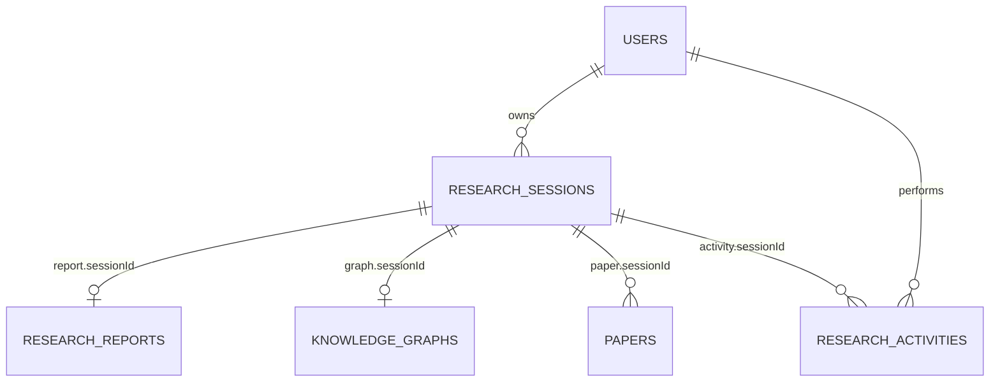
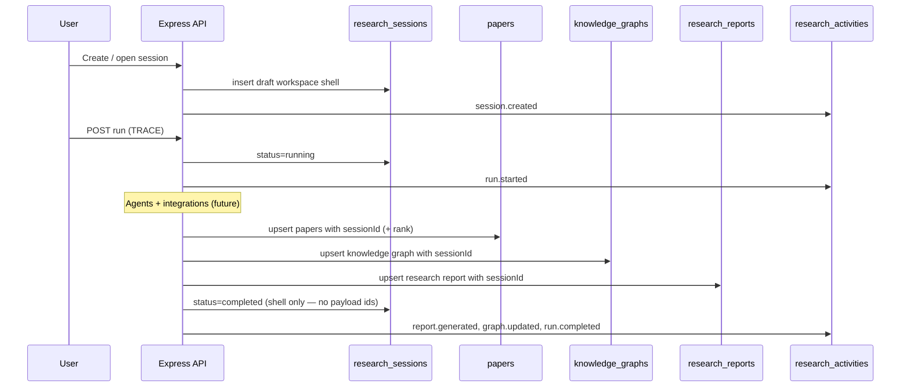
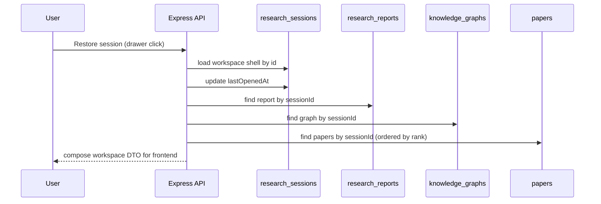

# TRACE Database Design Document (DDD)

**Project:** TRACE — Tracing Research Across Connected Evidence & Reasoning  
**Database:** MongoDB Atlas  
**Document status:** Architecture freeze (ResearchSession = lightweight workspace shell; children own research data via `sessionId`)  
**Audience:** Backend engineers implementing models, repositories, and APIs  

> **Scope rule:** This document defines collections, fields, relationships, indexes, and design rationale only. It does **not** include Mongoose schemas, repository code, or REST handlers. Implementation must follow this document as the single source of truth.

---

## Table of Contents

1. [Database Overview](#1-database-overview)
2. [Collection Architecture](#2-collection-architecture)
3. [Collection Specifications](#3-collection-specifications)
4. [Relationships](#4-relationships)
5. [Data Flow](#5-data-flow) (includes [Workspace restoration](#52-workspace-restoration-flow))
6. [Design Decisions](#6-design-decisions)
7. [Future Expansion](#7-future-expansion)
8. [Implementation Checklist](#8-implementation-checklist)
9. [Implementation Order](#9-implementation-order)
10. [Collection Dependency Matrix](#10-collection-dependency-matrix)
11. [Backend Development Phases](#11-backend-development-phases)
12. [Implementation Principles](#12-implementation-principles)
13. [Current Project Status](#13-current-project-status)

---

## 1. Database Overview

### 1.1 Why MongoDB

TRACE persists **heterogeneous, nested research artifacts**:

| Artifact | Shape |
| --- | --- |
| Research Insights report | Nested sections (findings, gaps, contradictions, confidence) |
| Knowledge graph | Variable-length `nodes[]` + `links[]` |
| Paper metadata | Sparse scholarly fields (DOI, badges, reproducibility, evidence spans) |
| Session workspace | Filters, uploads metadata, UI restore pointers |

A document database fits this better than normalized SQL for Phase 2:

- Flexible schemas evolve as GraphRAG and agents mature.  
- Nested JSON matches frontend contracts (`DEMO_REPORT`, `CONCEPT_GRAPH`, session snapshots).  
- MongoDB Atlas provides managed hosting aligned with the MERN stack.  
- Multi-hop citation/concept data is stored as arrays of edges without deep join trees.

### 1.2 Document-oriented design principles

1. **One document ≈ one aggregate root** for a clear write boundary.  
2. **Children reference the parent by `sessionId`** — the session never embeds research payloads.  
3. **Embed** only data that is always read/written with the parent and never shared.  
4. **Avoid unbounded arrays** on hot documents (e.g. do not embed papers, activities, or graph nodes on a session).  
5. **Align field names** with frontend payload keys where practical (`filters`, `status`, `nodes`, `links`).

### 1.3 Relationship strategy (references vs embedded)

| Pattern | When to use | TRACE examples |
| --- | --- | --- |
| **Reference (child → parent)** | Large or independently owned domain data | `ResearchReport.sessionId`, `KnowledgeGraph.sessionId`, `Paper.sessionId`, `ResearchActivity.sessionId` |
| **Embedded** | Small, private to parent, co-lifecycle | Session `filters` / `workspaceState`, paper `evidenceLocation`, graph node `properties` |
| **Denormalized drawer fields** | Fast list UI without joins | Session `sessionTitle`, `status`, `isPinned`, `updatedAt` only |

**Core principle:** *ResearchSession represents a saved workspace, not the research itself.*  
Drawer-list fields live on the session; papers, reports, graphs, contradictions, confidence, gaps, and evidence live in dedicated collections and are loaded by `sessionId` when the workspace is opened.

---

## 2. Collection Architecture

### Final collections (v1)

| Collection | Aggregate root | Primary consumers |
| --- | --- | --- |
| `users` | User account | Auth, preferences, ownership |
| `research_sessions` | Saved workspace shell (not research content) | Research Sessions drawer, workspace restore entry point |
| `papers` | Scholarly paper | Evidence Inspector, Citation Explorer, integrity |
| `research_reports` | Research Insights document | Report panel, PDF export input |
| `knowledge_graphs` | Concept / evidence graph | Concept Graph UI DTO |
| `research_activities` | Audit / timeline events | Future Agent Trace, analytics, restore auditing |

### Naming conventions

- Collection names: **snake_case plural** (`research_sessions`).  
- Field names: **camelCase** in application documents (matches JS/React).  
- Ids: MongoDB `ObjectId`; external ids (OpenAlex, DOI) stored as strings alongside.  
- Timestamps: `createdAt`, `updatedAt` (ISODate). Soft deletes use `deletedAt` / `archivedAt` where noted.

### Logical diagram

> **SRP:** The session is the entry point. Reports, graphs, papers, and activities each own their domain data and point back with `sessionId`. The session document does **not** hold `paperIds`, `reportId`, `graphId`, or embedded research content.

---

## 3. Collection Specifications

---

### 3.1 `users`

#### Purpose

Store authenticated researchers and their preferences. Ownership root for sessions and activities.

#### Responsibilities

- Identity and credentials metadata (hash stored; never plaintext passwords).  
- Theme / UI preferences synced from frontend `ThemeContext` (optional).  
- Soft account lifecycle (`isActive`, `deletedAt`).

#### Proposed fields

| Field | Type | Required | Default | Notes |
| --- | --- | --- | --- | --- |
| `_id` | ObjectId | yes | auto | Primary key |
| `email` | string | yes | — | Unique, lowercase normalized |
| `passwordHash` | string | yes* | — | *Required for local auth; omit if OAuth-only later |
| `displayName` | string | no | `"Researcher"` | Navbar label |
| `role` | string enum | yes | `"researcher"` | `researcher` \| `admin` |
| `preferences` | object | no | `{}` | Embedded |
| `preferences.theme` | string enum | no | `"light"` | `light` \| `dark` |
| `preferences.defaultFilters` | object | no | `{}` | Optional workspace defaults |
| `lastLoginAt` | date | no | null | |
| `isActive` | boolean | yes | `true` | |
| `createdAt` | date | yes | now | |
| `updatedAt` | date | yes | now | |
| `deletedAt` | date | no | null | Soft delete |

#### Validation rules

- `email`: valid email format; unique index; store lowercased.  
- `passwordHash`: min length enforced at service layer before hash (e.g. password ≥ 8).  
- `role`: allowlist enum only.  
- `preferences.theme`: allowlist enum only.

#### Index recommendations

| Index | Keys | Type | Rationale |
| --- | --- | --- | --- |
| `email_unique` | `{ email: 1 }` | unique | Login lookup |
| `active_users` | `{ isActive: 1, createdAt: -1 }` | regular | Admin listings |

#### Future extensibility

- OAuth providers array (`providers: [{ type, subject }]`).  
- Institution / lab affiliation.  
- API keys for programmatic TRACE runs.

---

### 3.2 `research_sessions`

#### Purpose

Lightweight **saved workspace** that lets a user reopen prior research configuration.  

> **Design principle:** *ResearchSession represents a saved workspace, not the research itself.*

It is the **entry point** for restore — not the store of papers, reports, graphs, AI outputs, contradictions, confidence scores, research gaps, or evidence.

#### Responsibilities

- Represent one saved workspace (title, query, domain, filters, sources, status).  
- Support pin / archive / rename for the Research Sessions drawer.  
- Store **lightweight UI restore state only** (`workspaceState`).  
- Act as the `sessionId` parent that other collections reference.

#### Explicit non-responsibilities (do not store here)

| Must NOT live on ResearchSession | Belongs in |
| --- | --- |
| Retrieved papers / paper bodies | `papers` |
| Research Insights (summary, findings, gaps, contradictions, confidence, references) | `research_reports` |
| Knowledge / evidence graphs | `knowledge_graphs` |
| AI agent outputs & reasoning traces | Future `agent_executions` / activities |
| Evidence locator / integrity / reproducibility payloads | `papers` (and report rollups) |

#### Proposed fields

| Field | Type | Required | Default | Notes |
| --- | --- | --- | --- | --- |
| `_id` | ObjectId | yes | auto | |
| `userId` | ObjectId | yes | — | Ref → `users` |
| `sessionTitle` | string | yes | — | Drawer title; may default from `researchQuery` |
| `researchQuery` | string | yes | — | Research question text |
| `domain` | string | no | `""` | Primary research domain |
| `paperTypes` | array\<string\> | yes | `[]` | Preferred publication types for this workspace |
| `filters` | object | yes | `{}` | Workspace filter configuration only |
| `filters.yearFrom` | string/number | no | `""` | |
| `filters.yearTo` | string/number | no | `""` | |
| `filters.publicationType` | string | no | `""` | |
| `filters.minCitations` | string/number | no | `""` | |
| `filters.openAccess` | boolean | no | `false` | |
| `filters.sortBy` | string | no | `"relevant"` | `relevant` \| `cited` \| `newest` |
| `selectedSources` | array\<string\> | yes | `[]` | e.g. `openalex`, `semantic_scholar`, `crossref` |
| `uploadedFiles` | array\<object\> | yes | `[]` | **Metadata only** (never binary / never parsed paper text) |
| `uploadedFiles[].name` | string | yes | — | Display name |
| `uploadedFiles[].size` | number | no | null | Bytes |
| `uploadedFiles[].mimeType` | string | no | null | |
| `uploadedFiles[].storageKey` | string | no | null | Future object-store key |
| `workspaceState` | object | no | `{}` | Lightweight UI restore only — **no research content** |
| `workspaceState.graphMode` | string | no | `"concept"` | `concept` \| `citation` |
| `workspaceState.selectedPaperId` | ObjectId/string | no | null | Selection pointer only |
| `workspaceState.selectedConceptId` | string | no | null | Graph node id pointer only |
| `workspaceState.expandedAccordion` | string | no | null | e.g. insights vs inspector |
| `workspaceState.activePanel` | string | no | null | Which panel was focused |
| `status` | string enum | yes | `"draft"` | `draft` \| `running` \| `completed` \| `failed` |
| `isPinned` | boolean | yes | `false` | Drawer pin |
| `isArchived` | boolean | yes | `false` | Hidden from default drawer list |
| `lastOpenedAt` | date | no | null | Updated when user restores the workspace |
| `createdAt` | date | yes | now | |
| `updatedAt` | date | yes | now | Drawer “last modified” |

#### `workspaceState` rules

- Store **UI pointers and layout preferences** only.  
- Do **not** store report sections, graph `nodes`/`links`, paper metadata, contradictions, confidence, gaps, or evidence text.  
- Selected paper/concept ids are pointers used after related collections are loaded by `sessionId`.

#### Validation rules

- `researchQuery`: trimmed; length 3–2000.  
- `sessionTitle`: trimmed; length 1–200.  
- `status`: enum allowlist.  
- `isArchived` and `isPinned`: if archived, prefer `isPinned = false` (application rule).  
- Session documents must **not** include `paperIds`, `reportId`, `graphId`, or embedded research aggregates.  
- Soft consistency: `status = completed` implies related report/graph/papers exist **in their collections** for this `sessionId` (enforced in services, not by embedding ids on the session).

#### Index recommendations

| Index | Keys | Type | Rationale |
| --- | --- | --- | --- |
| `user_updated` | `{ userId: 1, isArchived: 1, updatedAt: -1 }` | compound | Drawer list |
| `user_pinned` | `{ userId: 1, isPinned: 1, updatedAt: -1 }` | compound | Pinned section |
| `user_status` | `{ userId: 1, status: 1 }` | compound | Filter by Draft/Running/… |
| `title_text` | text on `sessionTitle`, `researchQuery` | text | Session search (later Atlas Search) |

#### Future extensibility

- `collaboratorIds[]` for shared workspaces.  
- `parentSessionId` for duplicated sessions lineage.  
- `tags[]` for user organization.  
- Run error details and agent milestones remain in `research_activities` (not on the session shell).

---

### 3.3 `papers`

#### Purpose

Canonical scholarly paper records used within a research workspace. Supports Evidence Inspector, integrity, reproducibility, and citation trees.

#### Responsibilities

- Store metadata from OpenAlex / Semantic Scholar / CrossRef (future).  
- Hold evidence locator fields (GROBID future).  
- Belong to a workspace via **`sessionId`** (child → parent). The session does **not** embed papers or maintain a `paperIds[]` array.

#### Proposed fields

| Field | Type | Required | Default | Notes |
| --- | --- | --- | --- | --- |
| `_id` | ObjectId | yes | auto | Internal id |
| `sessionId` | ObjectId | yes | — | Ref → `research_sessions` (workspace that retrieved / attached this paper) |
| `userId` | ObjectId | yes | — | Denormalized owner for authz |
| `rank` | number | no | null | Ordering within the session (replaces session-side `paperIds` order) |
| `externalIds` | object | no | `{}` | Dedup keys within a session / provider |
| `externalIds.doi` | string | no | null | Normalized lowercase |
| `externalIds.openAlexId` | string | no | null | |
| `externalIds.semanticScholarId` | string | no | null | |
| `externalIds.arxivId` | string | no | null | |
| `title` | string | yes | — | |
| `authors` | array\<string\> | yes | `[]` | Display names |
| `year` | number | no | null | |
| `venue` | string | no | `""` | |
| `abstract` | string | no | `""` | |
| `url` | string | no | null | Landing / PDF URL |
| `citationCount` | number | no | `0` | ≥ 0 |
| `confidence` | number | no | null | Quality hint 0–100 |
| `badges` | array\<string\> | yes | `[]` | e.g. Open Access, Peer Reviewed |
| `integrity` | object | no | `{}` | Embedded integrity snapshot |
| `integrity.peerReviewed` | boolean/string | no | null | |
| `integrity.openAccess` | boolean | no | null | |
| `integrity.retractionStatus` | string | no | `"none"` | |
| `integrity.correctionStatus` | string | no | `"none"` | |
| `integrity.venueQuality` | string | no | null | |
| `reproducibility` | object | no | `{}` | |
| `reproducibility.codeAvailable` | boolean | no | `false` | |
| `reproducibility.datasetAvailable` | boolean | no | `false` | |
| `reproducibility.githubRepository` | string | no | null | |
| `reproducibility.papersWithCode` | boolean | no | `false` | |
| `evidenceLocation` | object | no | null | Exact Evidence Locator |
| `evidenceLocation.page` | number/string | no | null | |
| `evidenceLocation.section` | string | no | null | |
| `evidenceLocation.paragraph` | number/string | no | null | |
| `evidenceLocation.sentence` | string | no | null | |
| `citationTree` | object | no | null | Optional hierarchical support tree fragment |
| `source` | string | no | `"manual"` | `openalex` \| `semantic_scholar` \| `upload` \| `manual` |
| `raw` | object | no | null | Optional raw provider payload (capped size) |
| `createdAt` | date | yes | now | |
| `updatedAt` | date | yes | now | |

#### Validation rules

- `sessionId`, `userId`: required.  
- `title`: required, non-empty, max ~500 chars.  
- `citationCount` ≥ 0.  
- `confidence` null or 0–100.  
- `externalIds.doi`: unique **per session** when present (compound sparse unique).  
- `url`: valid URL when present.  
- `badges`: strings from controlled vocabulary when possible.

#### Index recommendations

| Index | Keys | Type | Rationale |
| --- | --- | --- | --- |
| `session_rank` | `{ sessionId: 1, rank: 1 }` | compound | Load ordered papers for a workspace |
| `session_doi` | `{ sessionId: 1, "externalIds.doi": 1 }` | unique sparse compound | Dedup DOI within a session |
| `openalex_session` | `{ sessionId: 1, "externalIds.openAlexId": 1 }` | unique sparse compound | Dedup OpenAlex within a session |
| `title` | `{ title: 1 }` | regular | Admin search |
| `year` | `{ year: -1 }` | regular | Filter |

#### Future extensibility

- Global shared paper catalog + `session_papers` mapping (`sessionId`, `paperId`, `rank`) if true cross-session reuse is required — **without** putting id arrays back on the session.  
- Full-text / embedding references (`embeddingId` → vector DB).  
- `methodology` critique snippets per paper.  
- Versioned metadata revisions from providers.

---

### 3.4 `research_reports`

#### Purpose

Store the **Research Insights** document produced by the Synthesizer (and Critic inputs). Independent from the session shell so reports can be versioned and exported without rewriting session cards. Linked **only** via `sessionId` (session does not store `reportId`).

#### Responsibilities

- Persist summary, findings, gaps, contradictions, confidence, references.  
- Optional methodology / integrity rollups for the report as a whole.  
- Serve PDF generation and GET report APIs.

#### Proposed fields

| Field | Type | Required | Default | Notes |
| --- | --- | --- | --- | --- |
| `_id` | ObjectId | yes | auto | |
| `sessionId` | ObjectId | yes | — | Ref → `research_sessions` (1:1 preferred) |
| `userId` | ObjectId | yes | — | Denormalized owner for authz |
| `version` | number | yes | `1` | Increment on regenerate |
| `summary` | string | yes | — | Research Summary |
| `findings` | array\<string\> | yes | `[]` | Key Findings |
| `contradictions` | array\<string\> | yes | `[]` | |
| `researchGaps` | object | no | null | Structured gap block |
| `researchGaps.title` | string | no | — | |
| `researchGaps.summary` | string | no | — | |
| `researchGaps.evidence` | string | no | — | |
| `confidence` | number | yes | `0` | 0–100 overall score |
| `confidenceBreakdown` | object | no | null | From explainability service |
| `references` | array\<string\> | yes | `[]` | Citation strings |
| `methodology` | object | no | null | Critic strengths/weaknesses |
| `methodology.strengths` | array\<string\> | no | `[]` | |
| `methodology.weaknesses` | array\<string\> | no | `[]` | |
| `integrity` | array\<object\> | no | `[]` | Report-level integrity rows |
| `findingConceptMap` | object | no | `{}` | Finding index → concept node ids |
| `status` | string enum | yes | `"ready"` | `draft` \| `ready` \| `stale` |
| `generatedBy` | object | no | null | Agent / model metadata |
| `generatedBy.agentRunId` | string | no | null | Future AgentExecutions link |
| `generatedBy.model` | string | no | null | |
| `createdAt` | date | yes | now | |
| `updatedAt` | date | yes | now | |

#### Validation rules

- `sessionId`: required; unique among non-deleted reports for 1:1 (unique index).  
- `confidence`: 0–100 integer or number.  
- `findings`, `contradictions`, `references`: arrays of non-empty strings when present.  
- `version` ≥ 1.

#### Index recommendations

| Index | Keys | Type | Rationale |
| --- | --- | --- | --- |
| `session_unique` | `{ sessionId: 1 }` | unique | One active report per session (v1) |
| `user_updated` | `{ userId: 1, updatedAt: -1 }` | compound | User report history |

#### Future extensibility

- Report version history collection if unique constraint is relaxed.  
- Section-level provenance arrays (`findings[].paperIds`).  
- Multilingual summaries.

---

### 3.5 `knowledge_graphs`

#### Purpose

Persist the run-scoped **concept / evidence graph** shown in the Evidence Graph panel. Separate from AI reasoning artifacts and from the session shell. Linked **only** via `sessionId` (session does not store `graphId`).

#### Responsibilities

- Store nodes and links produced by `graph/builders`.  
- Supply data for `graph/visualization` DTOs (`kind`, `nodes`, `links`).  
- Support traversal and algorithms without loading the full report.

#### Proposed fields

| Field | Type | Required | Default | Notes |
| --- | --- | --- | --- | --- |
| `_id` | ObjectId | yes | auto | |
| `sessionId` | ObjectId | yes | — | Ref → `research_sessions` |
| `userId` | ObjectId | yes | — | Owner denormalized |
| `runId` | string | no | null | Logical run identifier |
| `kind` | string | yes | `"concept"` | Aligns with frontend |
| `nodes` | array\<object\> | yes | `[]` | Embedded graph nodes |
| `nodes[].id` | string | yes | — | Stable string id within graph |
| `nodes[].label` | string | yes | — | |
| `nodes[].type` | string | yes | — | Concept, Method, Dataset, … |
| `nodes[].importance` | string | no | `"minor"` | `primary` \| `major` \| `minor` |
| `nodes[].description` | string | no | `""` | |
| `nodes[].relatedPaperIds` | array\<string/ObjectId\> | no | `[]` | |
| `nodes[].x` | number | no | null | Optional layout hint |
| `nodes[].y` | number | no | null | Optional layout hint |
| `nodes[].properties` | object | no | `{}` | Extensible |
| `links` | array\<object\> | yes | `[]` | Embedded edges |
| `links[].id` | string | yes | — | |
| `links[].source` | string | yes | — | Node id |
| `links[].target` | string | yes | — | Node id |
| `links[].type` | string | yes | — | Relationship label |
| `links[].explanation` | string | no | `""` | Edge explainability |
| `links[].confidence` | number | no | null | 0–100 |
| `links[].supportingPaperIds` | array\<string/ObjectId\> | no | `[]` | |
| `links[].properties` | object | no | `{}` | |
| `stats` | object | no | `{}` | Cached counts |
| `stats.nodeCount` | number | no | `0` | |
| `stats.linkCount` | number | no | `0` | |
| `schemaVersion` | number | yes | `1` | Graph document version |
| `createdAt` | date | yes | now | |
| `updatedAt` | date | yes | now | |

#### Validation rules

- Every `links[].source` / `target` must exist in `nodes[].id` (service-level validate via `graph/serializers`).  
- Node and link ids unique within the document.  
- `confidence` null or 0–100.  
- Soft cap: e.g. ≤ 5,000 nodes per graph for v1 (enforce in service).

#### Index recommendations

| Index | Keys | Type | Rationale |
| --- | --- | --- | --- |
| `session_unique` | `{ sessionId: 1 }` | unique | One graph per session (v1) |
| `user_updated` | `{ userId: 1, updatedAt: -1 }` | compound | |

#### Future extensibility

- Multiple graphs per session (`kind: citation_projection`).  
- Community detection results cached under `stats.communities`.  
- Diff / delta merges from Explorer expansion.

---

### 3.6 `research_activities`

#### Purpose

Append-only (or soft-mutable) **activity stream** for a session. Replaces a simplistic “search history string list” with structured events that support explainability, auditing, and the Research Sessions experience.

#### Responsibilities

- Record workspace lifecycle events (created, run started, completed, failed).  
- Record human feedback (pin paper, mark relevant, restore session).  
- Feed future Agent Trace timelines without overloading `research_sessions`.

#### Proposed fields

| Field | Type | Required | Default | Notes |
| --- | --- | --- | --- | --- |
| `_id` | ObjectId | yes | auto | |
| `userId` | ObjectId | yes | — | Actor |
| `sessionId` | ObjectId | yes | — | Subject workspace |
| `type` | string enum | yes | — | See event vocabulary below |
| `message` | string | no | `""` | Human-readable summary |
| `payload` | object | no | `{}` | Event-specific data |
| `agentId` | string | no | null | `planner` … `synthesizer` |
| `paperId` | ObjectId | no | null | When event concerns a paper |
| `severity` | string | yes | `"info"` | `info` \| `warning` \| `error` |
| `createdAt` | date | yes | now | Immutable event time |

#### Event vocabulary (`type`) — v1

| Type | Meaning |
| --- | --- |
| `session.created` | Workspace created |
| `session.renamed` | Title changed |
| `session.restored` | Drawer resume |
| `session.archived` | Archived |
| `session.deleted` | Soft/hard delete |
| `run.started` | TRACE run began |
| `run.completed` | TRACE run finished |
| `run.failed` | TRACE run failed |
| `agent.started` | Agent stage started |
| `agent.completed` | Agent stage completed |
| `paper.pinned` | User pinned paper |
| `paper.feedback` | Relevant / not-relevant / replace |
| `report.generated` | Report written |
| `graph.updated` | Graph rebuilt/merged |

#### Validation rules

- `type`: allowlist enum.  
- `sessionId` + `userId` required.  
- `payload` size capped (e.g. ≤ 16KB) to protect storage.  
- Activities are not updated in place (append-only preferred).

#### Index recommendations

| Index | Keys | Type | Rationale |
| --- | --- | --- | --- |
| `session_time` | `{ sessionId: 1, createdAt: -1 }` | compound | Session timeline |
| `user_time` | `{ userId: 1, createdAt: -1 }` | compound | User activity feed |
| `type_time` | `{ type: 1, createdAt: -1 }` | compound | Operational queries |

#### Future extensibility

- Link `payload.trace` to detailed AgentExecutions.  
- TTL indexes for ephemeral debug events.  
- Streaming to Socket.io as activities are inserted.

---

## 4. Relationships

### 4.1 Relationship matrix

| From | To | Cardinality | Mechanism | Why |
| --- | --- | --- | --- | --- |
| `users` → `research_sessions` | 1:N | `research_sessions.userId` | User owns many workspace shells |
| `research_sessions` → `research_reports` | 1:1 (v1) | **`research_reports.sessionId` only** | Report owns insights; session stays lightweight |
| `research_sessions` → `knowledge_graphs` | 1:1 (v1) | **`knowledge_graphs.sessionId` only** | Graph owns topology; no `graphId` on session |
| `research_sessions` → `papers` | 1:N (v1) | **`papers.sessionId`** (+ optional `rank`) | Papers loaded by session; no `paperIds[]` on session |
| `users` → `research_activities` | 1:N | `activities.userId` | Audit actor |
| `research_sessions` → `research_activities` | 1:N | `activities.sessionId` | Timeline per workspace |

### 4.2 Why ResearchSession does not own research data

ResearchSession is a **saved workspace**, not the research itself (SRP).

Embedding or reverse-pointer arrays (`paperIds`, `reportId`, `graphId`) on the session would:

- Bloat the drawer document on every agent write.  
- Couple session card updates to report/graph/paper churn.  
- Blur ownership — each collection should own only its domain.

**Chosen:** children reference `sessionId`. Restore queries: `find({ sessionId })` on papers / report / graph / activities.

### 4.3 Why not embed papers / report / graph in the session

| Artifact | Why separate |
| --- | --- |
| Papers | Large metadata + evidence; ordered via `rank` under `sessionId` |
| Report | Multi-section insights; versioned independently |
| Graph | Multi-KB node/link payload; independent update cadence |

**Chosen:** dedicated collections. Session keeps workspace configuration + `workspaceState` only.

### 4.4 Optional future mapping for shared papers

If a global paper catalog is required later, introduce `session_papers { sessionId, paperId, rank }` — still **without** embedding id arrays on `research_sessions`.

### 4.5 Embedded documents (within collections)

| Parent | Embedded | Reason |
| --- | --- | --- |
| Session | `filters`, `uploadedFiles`, `workspaceState` | Always loaded with session card/restore config |
| Paper | `integrity`, `reproducibility`, `evidenceLocation` | Cohesive paper view |
| Report | `researchGaps`, `methodology`, `confidenceBreakdown` | Single insights document |
| Graph | `nodes[]`, `links[]` | Atomic graph aggregate for traversal/visualization |

---

## 5. Data Flow

### 5.1 Happy path (TRACE run)

### 5.2 Workspace restoration flow

When a user clicks a Research Session in the drawer:

1. **Load ResearchSession** — workspace shell (`sessionTitle`, query, filters, sources, `workspaceState`, status).  
2. **Restore workspace configuration** — apply filters, domain, paper types, selected sources, `workspaceState` UI pointers.  
3. **Load ResearchReport** — `findOne({ sessionId })` (insights, gaps, contradictions, confidence — never from the session).  
4. **Load KnowledgeGraph** — `findOne({ sessionId })`.  
5. **Load Papers** — `find({ sessionId }).sort({ rank: 1 })`.  
6. **Restore the complete frontend workspace** — hydrate panels using loaded collections + `workspaceState` pointers (`selectedPaperId`, `graphMode`, etc.).

The session document itself **never** contains the full research data.

### 5.3 Narrative flow

1. **User** authenticates → `users`.  
2. **ResearchSession** created (`draft`) as a workspace shell (`researchQuery`, `filters`, …).  
3. TRACE **run** sets `running`; Explorer/integrations upsert **Papers** with `sessionId`.  
4. Connector/graph layer writes **KnowledgeGraph** with `sessionId`.  
5. Critic/Synthesizer writes **ResearchReport** with `sessionId`; session `status` → `completed`.  
6. Each milestone appends **ResearchActivities** with `sessionId`.  
7. Drawer lists **ResearchSessions** only; open/resume hydrates report, graph, and papers **by `sessionId`**.

### 5.4 Failure path

- On agent/API failure: `research_sessions.status = failed`; details recorded in `research_activities` (`run.failed`).  
- Partial papers/graph/report may exist under the same `sessionId`; UI should tolerate missing report/graph while the shell remains listable.

---

## 6. Design Decisions

### 6.1 ResearchSession remains a lightweight workspace

**Decision:** *ResearchSession represents a saved workspace, not the research itself.*

Session documents hold only what is required to reopen a workspace: identity, query/config, filters, sources, upload metadata, pin/archive, status, timestamps, and lightweight `workspaceState`.

They do **not** store papers, reports, graphs, AI outputs, contradictions, confidence scores, research gaps, or evidence data.

**Why (SRP):**

- Research Sessions drawer must list dozens of workspaces quickly.  
- Matches frontend cards: title, status, updated time, pin only.  
- Prevents document bloat and multi-MB updates on every agent tick.  
- Each collection owns only its domain; children link via `sessionId`.

### 6.2 Papers are stored separately (sessionId on paper)

**Decision:** Canonical `papers` collection; each paper documents its workspace with `sessionId` (and optional `rank`). No `paperIds[]` on the session.

**Why:**

- Session shell stays constant-size regardless of result set size.  
- Evidence Inspector and integrity updates target paper documents.  
- Ordered restore via `{ sessionId, rank }` index.  
- Future global reuse can add a mapping collection without changing the session schema.

### 6.3 Reports are independent

**Decision:** `research_reports` is its own collection with 1:1 `sessionId` in v1. Session does **not** store `reportId`.

**Why:**

- Report JSON is large and sectioned (findings, gaps, contradictions, confidence).  
- Regeneration increments `version` without rewriting session card fields.  
- PDF/export APIs fetch report by `sessionId` alone.

### 6.4 Graphs have their own collection

**Decision:** `knowledge_graphs` separate from AI collections and from sessions; linked only by `sessionId` (no `graphId` on session).

**Why:**

- Aligns with backend SRP: `graph/` owns topology; `ai/` owns reasoning.  
- Visualization and traversal load only graph documents.  
- Avoids coupling report text updates to graph layout updates.

### 6.5 ResearchActivities instead of simple search history

**Decision:** Structured activity events replace a flat `recentSearches: string[]` as the system of record.

**Why:**

- Frontend “Recent Searches” can remain a UX convenience; durable history is session + activity based.  
- Supports explainability (what ran, what failed, what the user pinned).  
- Scales better than embedding unbounded history on the user or session document.  
- Maps cleanly to future Agent Trace / Socket streams.

---

## 7. Future Expansion

The following collections are **out of scope for v1 schema freeze** but may be added later. Do not design fields now beyond this mention:

| Future collection | Likely purpose |
| --- | --- |
| `agent_executions` | Per-agent traces (searched / selected / rejected / reasoning) |
| `session_papers` | Optional mapping if a global paper catalog is shared across sessions |
| `collaborations` | Shared sessions, roles, invites |
| `notifications` | Run complete / failure alerts |
| `uploads` | Binary source file metadata + storage keys |
| `embeddings` or external vector DB | Chunk vectors for RAG (Qdrant/Weaviate) |
| `provider_cache` | Cached OpenAlex / S2 responses |
| `report_versions` | Full report history if 1:1 unique is relaxed |

---

## 8. Implementation Checklist

When implementing models (next phase), engineers should:

1. Create Mongoose models **exactly** from §3 field tables.  
2. Apply indexes from each collection’s index table.  
3. Enforce enums and required fields in schema + validators.  
4. Keep repositories as the only Mongo access layer.  
5. Emit `research_activities` from services on lifecycle transitions.  
6. Keep `research_sessions` as a **workspace shell only** — never embed reports, graphs, papers, AI outputs, gaps, contradictions, confidence, or evidence.  
7. Link research data with **`sessionId` on child documents** — do not store `paperIds` / `reportId` / `graphId` on the session.  
8. Upsert papers by `(sessionId, externalIds.doi)` / OpenAlex id when available.  
9. Update this document via PR if the architecture must change — code follows the DDD, not the reverse.

---

## 9. Implementation Order

Backend models must be introduced in a **dependency-first** sequence. Implementing every collection at once creates missing foreign keys, circular imports between models/repositories, and repeated refactors when a parent aggregate is not yet stable.

Wrong-order symptoms include:

- Referencing `userId` before the User model exists.  
- Creating reports/graphs/papers that cannot validate `sessionId`.  
- Wiring activities before sessions can be created.  
- Rewriting indexes and validators after late discovery of ownership rules.  
- Accidentally putting `paperIds` / `reportId` / `graphId` back onto the session shell.

### Recommended order

| Step | Collection | Why this stage | Depends on (already built) | Unlocks (downstream) |
| --- | --- | --- | --- | --- |
| **1** | **Users** | Ownership and authz root; no TRACE document makes sense without an owner. | None | ResearchSessions, ResearchActivities (actor), all user-scoped queries |
| **2** | **ResearchSessions** | Lightweight workspace shell; drawer and restore entry point. | Users | Papers, KnowledgeGraphs, ResearchReports, ResearchActivities (all via `sessionId`) |
| **3** | **Papers** | Scholarly entities scoped by `sessionId`; needed before graphs/reports can cite evidence. | ResearchSessions | KnowledgeGraphs, ResearchReports |
| **4** | **KnowledgeGraphs** | Concept graph payload; requires valid `sessionId` (and preferably papers). | ResearchSessions, Papers | ResearchReports, GraphRAG visualization APIs |
| **5** | **ResearchReports** | Insights document keyed by `sessionId`. | ResearchSessions, Papers, KnowledgeGraphs | PDF/export APIs, frontend Report panel hydration |
| **6** | **ResearchActivities** | Append-only timeline keyed by `sessionId`. | ResearchSessions (and typically Users as actor) | Agent Trace, auditing, analytics (future) |

### Stage notes

1. **Users** — Implement first so every subsequent document can set a valid `userId`. No other v1 collection is a dependency.  
2. **ResearchSessions** — Implement second as the workspace shell only. Depends on Users. Downstream collections hang off `sessionId`, not session-side foreign-key arrays.  
3. **Papers** — Implement third with required `sessionId` (+ optional `rank`). Used by graphs and reports.  
4. **KnowledgeGraphs** — Implement fourth with `sessionId`. Used by reports and graph APIs.  
5. **ResearchReports** — Implement fifth with `sessionId`. Little depends on reports in v1 beyond read/export.  
6. **ResearchActivities** — Implement last among v1 collections so events can reference real `sessionId` values.

---

## 10. Collection Dependency Matrix

| Collection | Depends On | Used By |
| --- | --- | --- |
| Users | None | ResearchSessions, ResearchActivities |
| ResearchSessions | Users | Papers, KnowledgeGraphs, ResearchReports, ResearchActivities (via `sessionId`) |
| Papers | ResearchSessions (`sessionId`) | KnowledgeGraphs, ResearchReports |
| KnowledgeGraphs | ResearchSessions, Papers | ResearchReports |
| ResearchReports | ResearchSessions, Papers, KnowledgeGraphs | — (consumers: APIs / PDF / UI) |
| ResearchActivities | ResearchSessions (and Users as actor) | — (consumers: Trace / analytics) |

### Why this chain minimizes coupling

- **Acyclic ownership:** Users → Sessions ← (Papers, Graphs, Reports, Activities via `sessionId`) — children depend on the session; the session does not depend on children.  
- **Incremental delivery:** Each step yields a testable Atlas slice (e.g. create user + session before papers).  
- **Stable contracts:** Downstream collections only appear after parent ids and indexes exist.  
- **SRP:** Session shell never grows with research payloads; collections stay independently maintainable.  
- **Activities last:** Observability does not block core persistence; events attach when the lifecycle is real.

---

## 11. Backend Development Phases

Roadmap after this database design freeze:

### Phase 1 — Backend Foundation

**Status: Completed**

- Express server (`app.js`, `server.js`)  
- Environment configuration (`config/environment/env.js`)  
- MongoDB Atlas connection (`config/database/mongo.js`)  
- Folder architecture (`ai/`, `graph/`, `repositories/`, `validators/`, …)  
- Project structure and health route  

### Phase 2 — Database Layer

- Mongoose schemas (from §3)  
- Validation aligned with this DDD  
- Indexes from each collection’s index tables  
- Repositories as the only Mongo access layer  

### Phase 3 — Business Logic

- Services  
- Session management  
- Paper management  
- Report management  
- Graph management  

### Phase 4 — REST APIs

- Controllers  
- Routes  
- Request validation  
- Error handling (building on existing middleware)  

### Phase 5 — AI Integration

- Planner Agent  
- Explorer Agent  
- Connector Agent  
- Critic Agent  
- Synthesizer Agent  

### Phase 6 — GraphRAG Pipeline

- OpenAlex integration  
- Semantic Scholar integration  
- CrossRef integration  
- Embedding generation  
- Vector retrieval  
- Knowledge graph construction  
- Explainability pipeline  

### Phase 7 — Frontend Integration

- Replace dummy / simulated data  
- Connect REST APIs  
- Persist sessions  
- Persist reports  
- Dynamic graph generation  

---

## 12. Implementation Principles

Engineering rules for TRACE backend development:

- Implement **one collection completely** before moving to the next (per §9 order).  
- **Test every model against MongoDB Atlas** before adding dependent models.  
- After each model, create the matching **Repository → Service → Controller → Route** slice when that collection is ready for HTTP—not unused stubs for unbuilt domains.  
- **Avoid generating unused code.**  
- Keep every layer **modular with a single responsibility** (repositories for DB only; services for business rules; controllers for HTTP).  
- **Do not introduce placeholder business logic** where real implementation is planned (prefer clear “not implemented” boundaries only in long-lived scaffolds already approved).  
- Use **consistent naming** (`camelCase` fields, snake_case collections, `*.model.js` / `*.repository.js` conventions).  
- Prefer **incremental development with frequent testing** over implementing everything at once.

---

## 13. Current Project Status

Checkpoint before backend model implementation begins:

| Area | Status |
| --- | --- |
| Frontend research workspace (panels, sessions drawer, graphs, PDF) | ✓ Functionally complete (Phase 1 UI) |
| Backend infrastructure (Express, env, Atlas connection, folders) | ✓ Complete |
| MongoDB Atlas | ✓ Connected successfully |
| Database architecture (`docs/DATABASE_DESIGN.md` §§1–8) | ✓ Finalized / frozen |
| AI architecture scaffolding (`backend/src/ai/`) | ✓ Scaffolded |
| Graph architecture scaffolding (`backend/src/graph/`) | ✓ Scaffolded |

**Next step:** Enter backend implementation beginning with the **User** model (§9 step 1), then proceed through ResearchSessions → Papers → KnowledgeGraphs → ResearchReports → ResearchActivities.

---

## Document control

| Item | Value |
| --- | --- |
| Path | `docs/DATABASE_DESIGN.md` |
| Phase | Architecture freeze — ResearchSession is workspace shell only; auth implemented; models pending for sessions+ |
| Database name (Atlas) | `trace_db` (from connection URI) |
| Related frontend | Research Sessions drawer, Evidence Inspector, Concept Graph |
| Related backend folders | `models/`, `repositories/`, `graph/`, `ai/` (logic only; no schemas in this doc) |

**End of Database Design Document**
